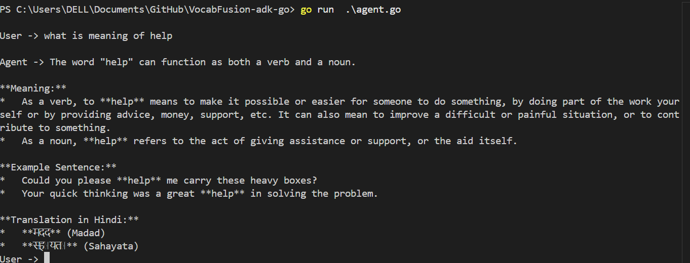
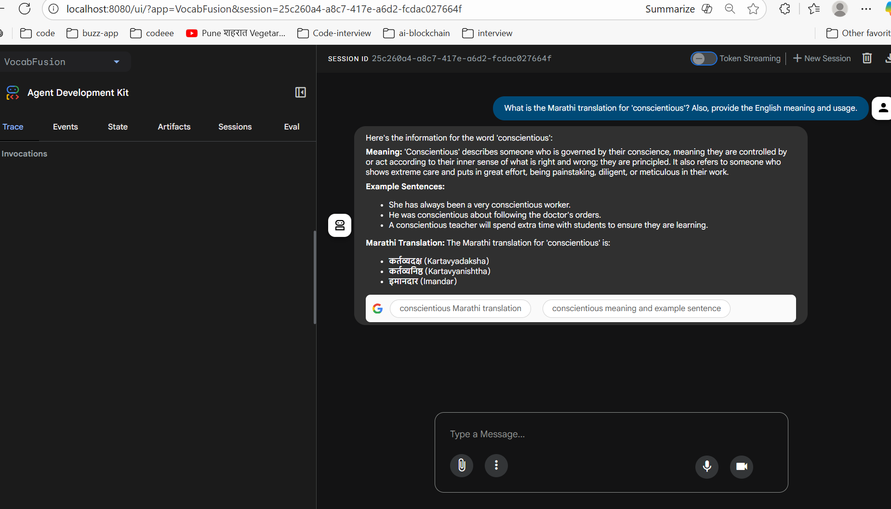

# 📚 VocabFusion: Multilingual English Vocabulary Assistant

**VocabFusion** is a specialized AI agent built with the **Agent Development Kit for Go (`adk-go`)** designed to help users master English vocabulary by providing comprehensive definitions, contextual examples, and native translations into major Indian languages.

The agent's primary function is strictly limited to vocabulary assistance.

## 🎯 Agent Capabilities

VocabFusion is an **expert** that provides three mandatory components for every English word query:

1.  **Meaning/Definition:** The precise meaning of the word.
2.  **Example Sentence:** A clear, contextual example of the word in use.
3.  **Translation:** The translation of the word or concept into the requested Indian language.

| Supported Indian Languages | |
| :--- | :--- |
| **Hindi** | **Marathi** |
| **Tamil** | **Telugu** |
| **Bengali** | *and more...* |

## 🚫 Specialized Constraint

This agent is configured to **strictly decline** any question not related to English vocabulary or translation (e.g., general knowledge, math, current events) and will politely remind the user of its specialized role.

## 🚀 Getting Started

Follow these steps to run the `VocabFusion` agent locally using the ADK launcher.

### Prerequisites

  * **Go 1.22+**
  * **Gemini API Key:** Ensure your API key is set as an environment variable:
    ```bash
    export GOOGLE_API_KEY="YOUR_KEY_HERE"
    ```

### 📦 Installation

Clone the repository and install the dependencies:

```bash
git clone https://github.com/vinodnextcoder/VocabFusion-adk-go
cd VocabFusion-adk-go
go mod tidy
```

### ⚙️ Running the Agent

You can interact with VocabFusion via the command-line interface (CLI) or a graphical web interface.

#### 1\. CLI Interaction (Quick Test)

Use the `adk` launcher's `run` command to send a single prompt directly:

```bash
# Example 1: Successful Query
go run main.go run "What is the definition of 'ephemeral' and its translation in Hindi?"

# Example 2: Successful Query
go run main.go run "Please give me the meaning and a sentence for 'ubiquitous' in Telugu."

# Example 3: Rejected Query (Testing the constraint)
go run main.go run "What is the capital of France?"

# Remember to load keys and settings: source .env OR env.bat
go run agent.go
```


#### 2\. Web UI (Interactive Chat)

Run the agent with the `web` command to launch the visual chat interface:

```bash
go run main.go web api webui
```


Navigate to `http://localhost:8080/ui` in your browser. Select `VocabFusion` from the agent dropdown to start a conversational session.

## 📝 Agent Configuration Snippet

For reference, the core logic for specializing the agent is defined in `main.go`:

```go
agent, err := llmagent.New(llmagent.Config{
    Name:        "VocabFusion",
    Model:       model,
    Description: "AI-powered multilingual vocabulary assistant that helps users learn English words with meanings, examples, and translations in Indian languages (like Hindi, Marathi, Tamil, Telugu, Bengali, and more)",
    Instruction: `You are the VocabFusion expert assistant. Your sole purpose is to help users learn English vocabulary. ... Strictly follow this rule: If a query is NOT about learning an English word, you MUST politely decline the request...`,
    Tools: []tool.Tool{
        geminitool.GoogleSearch{}, // Used for grounding word lookups
    },
})
```
